# 🌟 Huroof - حروف 🌟

<div align="center">

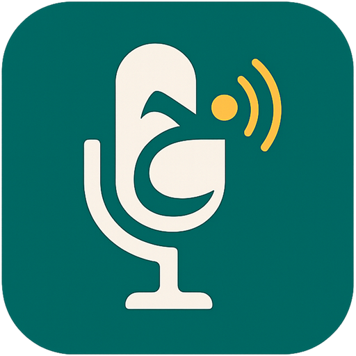

**An AI-Powered Arabic Pronunciation Learning Platform**

[](https://flutter.dev/)
[](https://dart.dev/)
[](LICENSE)
[](pubspec.yaml)

_Master Arabic pronunciation with AI-powered feedback_

</div>

---

## 📋 Table of Contents

- [🎯 About](#-about)
- [✨ Features](#-features)
- [🖼️ Screenshots](#️-screenshots)
- [🏗️ Architecture](#️-architecture)
- [⚙️ Installation](#️-installation)
- [🚀 Usage](#-usage)
- [🔧 Configuration](#-configuration)
- [📁 Project Structure](#-project-structure)
- [🛠️ Tech Stack](#️-tech-stack)
- [🤝 Contributing](#-contributing)
- [🧪 Testing](#-testing)
- [📚 Documentation](#-documentation)
- [🗺️ Roadmap](#️-roadmap)
- [🎉 Acknowledgments](#-acknowledgments)
- [📜 License](#-license)

---

## 🎯 About

**Huroof** (حروف) is an innovative Arabic language learning application that focuses specifically on pronunciation training using advanced AI technology. Built with Flutter and powered by OpenAI's Whisper ASR model, Huroof provides learners with real-time pronunciation feedback for Arabic letters and their short vowel combinations.

### 🎯 Mission

To make Arabic pronunciation learning accessible, interactive, and effective through cutting-edge AI technology and intuitive user experience design.

### 🎯 Vision

To become the leading platform for Arabic pronunciation training, helping learners master the fundamentals of Arabic phonetics with confidence and accuracy.

---

## ✨ Features

### 🎵 **AI-Powered Pronunciation Analysis**

- **Whisper ASR Integration**: Advanced speech recognition for accurate pronunciation assessment
- **Binary Feedback System**: Clear "Correct" or "Try Again" responses
- **Real-time Analysis**: Instant feedback within 5 seconds

### 📚 **Comprehensive Learning Modules**

- **Letter Selection**: Interactive grid of Arabic letters (ب، ت، ث، ج...)
- **Short Vowel Forms**: Practice with combinations like با، بو، بي
- **Visual Learning**: 28 Makhraj images showing correct tongue and mouth positions
- **Audio Playback**: High-quality pre-recorded pronunciation examples
- **Drawing Animation**: Interactive letter tracing with Lottie animations

### 🎨 **Modern User Experience**

- **Intuitive Interface**: Clean, Arabic-friendly design
- **Responsive Layout**: Optimized for mobile devices
- **Smooth Animations**: Lottie animations for engaging interactions
- **Multilingual Support**: Arabic and English interface

### 📱 **Mobile-First Design**

- **Cross-Platform**: Android and iOS support
- **Offline Capability**: Core features work without internet
- **Performance Optimized**: Smooth 60fps animations
- **Accessibility**: Screen reader and voice-over support

### 🎬 **Live Demo**

<div align="center">

**Experience Huroof in Action**

[](https://youtube.com/watch?v=demo-video)
[](https://huroof-demo.web.app)

_Click the buttons above to see Huroof in action_

</div>

---

## 🖼️ Screenshots

<div align="center">

|                                  Home Screen                                  |                                  Letter Details                                  |                                  Pronunciation Practice                                  |
| :---------------------------------------------------------------------------: | :------------------------------------------------------------------------------: | :--------------------------------------------------------------------------------------: |
| 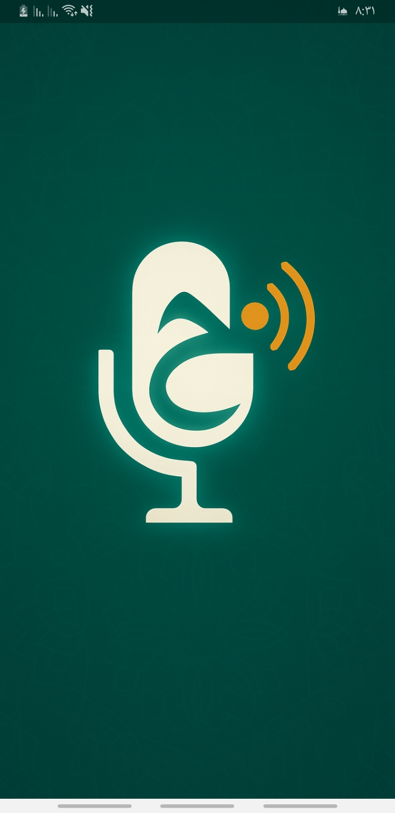 | 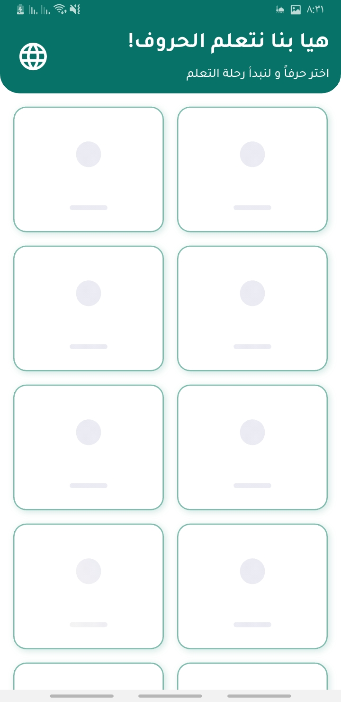 | 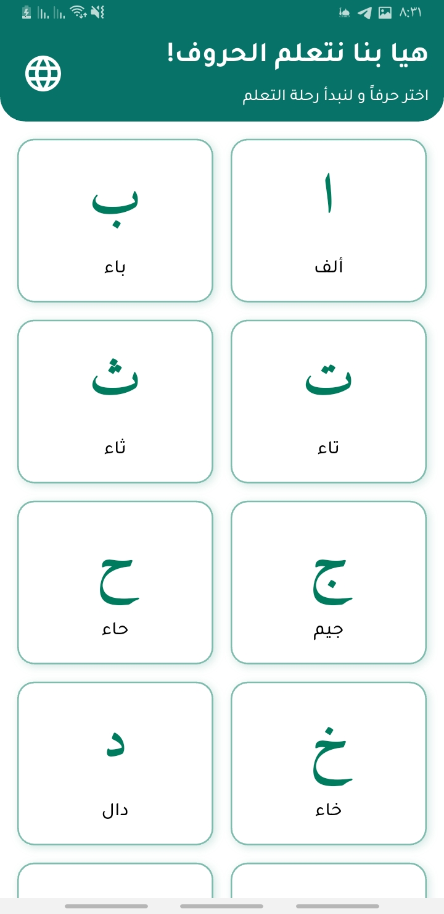 |

|                                  Makhraj Visualization                                  |                                  Audio Playback                                  |                                  Progress Tracking                                  |
| :-------------------------------------------------------------------------------------: | :------------------------------------------------------------------------------: | :---------------------------------------------------------------------------------: |
| 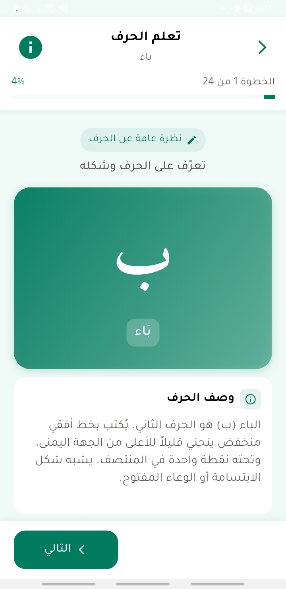 | 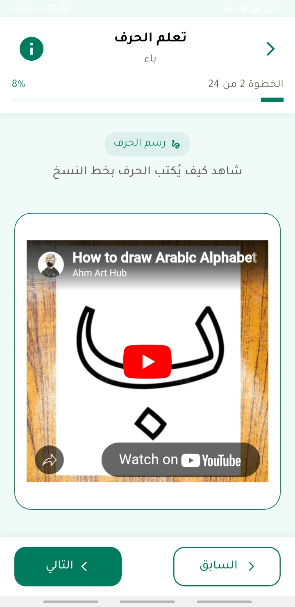 | 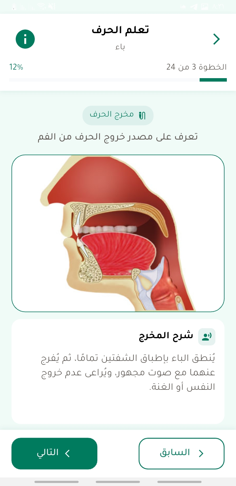 |

### 📱 **Additional Screenshots**

|                                  Letter Selection                                  |                                  Drawing Animation                                  |                                  Audio Recording                                  |
| :--------------------------------------------------------------------------------: | :---------------------------------------------------------------------------------: | :-------------------------------------------------------------------------------: |
| 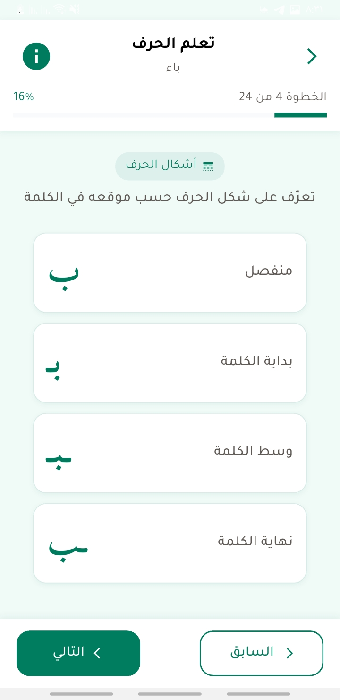 | 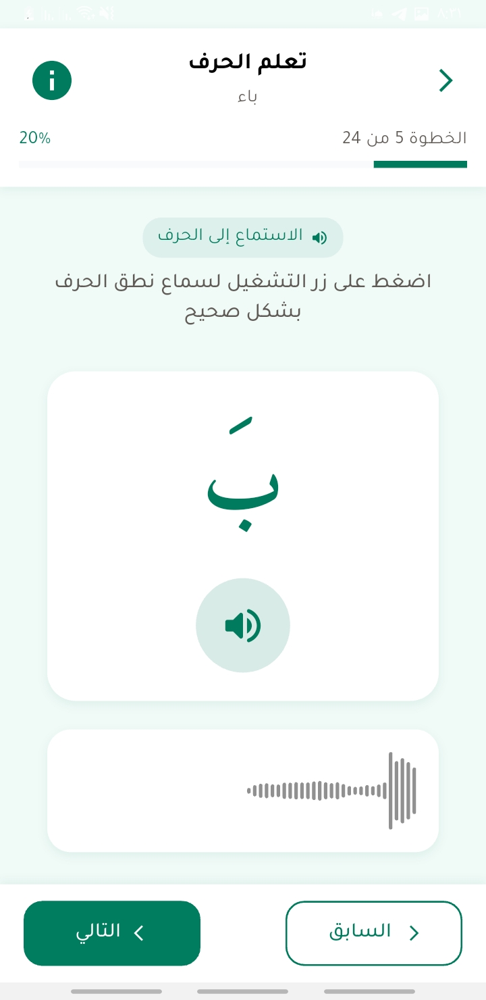 |  |

|                                  Success Feedback                                   |                                  Error Handling                                   |                                  Settings Menu                                   |
| :---------------------------------------------------------------------------------: | :-------------------------------------------------------------------------------: | :------------------------------------------------------------------------------: |
| 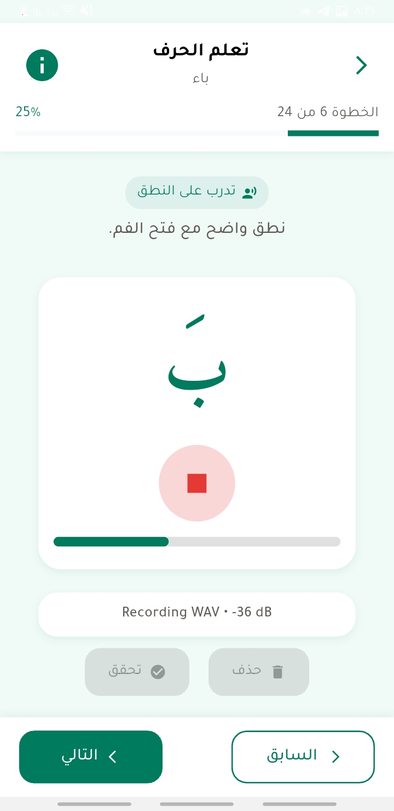 | 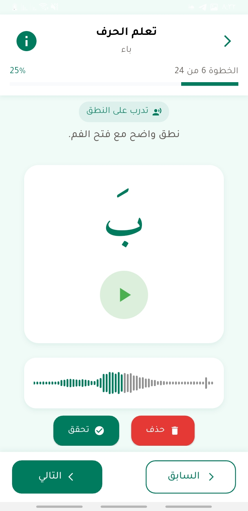 | 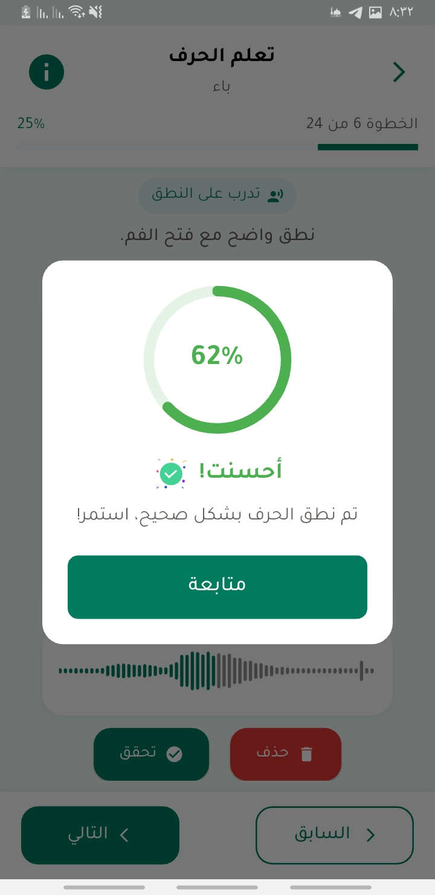 |

|                                  Progress Overview                                   |                                  Final Results                                   |                                  Additional Screen                                  |
| :----------------------------------------------------------------------------------: | :------------------------------------------------------------------------------: | :---------------------------------------------------------------------------------: |
| 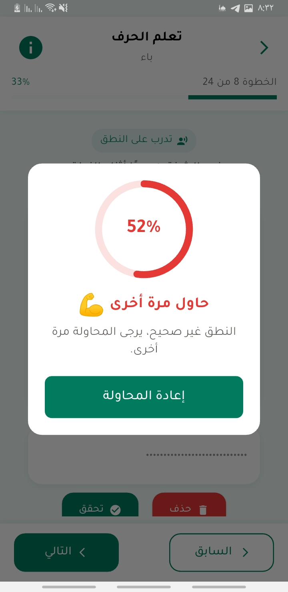 | 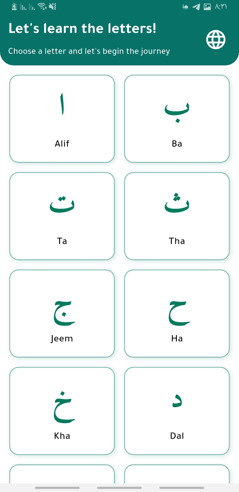 |  |

</div>

---

## 🏗️ Architecture

### 🏛️ **System Architecture**

```
┌─────────────────────────────────────────────────────────────────────────────────┐
│                                USER INTERFACE LAYER                             │
├─────────────────────────────────────────────────────────────────────────────────┤
│  ┌─────────────┐  ┌─────────────┐  ┌─────────────┐  ┌─────────────┐             │
│  │   Splash    │  │    Home     │  │   Letter    │  │  Practice   │             │
│  │   Screen    │  │   Screen    │  │  Details    │  │   Screen    │             │
│  └─────────────┘  └─────────────┘  └─────────────┘  └─────────────┘             │
└─────────────────────────────────────────────────────────────────────────────────┘
                                        │
                                        ▼
┌─────────────────────────────────────────────────────────────────────────────────┐
│                              PRESENTATION LAYER                                 │
├─────────────────────────────────────────────────────────────────────────────────┤
│  ┌─────────────┐  ┌─────────────┐  ┌─────────────┐  ┌─────────────┐             │
│  │   GetX      │  │   Flutter   │  │   Custom    │  │   Lottie    │             │
│  │   State     │  │   Widgets   │  │   Widgets   │  │ Animations  │             │
│  │ Management  │  │             │  │             │  │             │             │
│  └─────────────┘  └─────────────┘  └─────────────┘  └─────────────┘             │
└─────────────────────────────────────────────────────────────────────────────────┘
                                        │
                                        ▼
┌─────────────────────────────────────────────────────────────────────────────────┐
│                               BUSINESS LOGIC LAYER                              │
├─────────────────────────────────────────────────────────────────────────────────┤
│  ┌─────────────┐  ┌─────────────┐  ┌─────────────┐  ┌─────────────┐             │
│  │   Home      │  │   Letter    │  │   Audio     │  │   Record    │             │
│  │ Controller  │  │ Controller  │  │ Controller  │  │ Controller  │             │
│  └─────────────┘  └─────────────┘  └─────────────┘  └─────────────┘             │
└─────────────────────────────────────────────────────────────────────────────────┘
                                        │
                                        ▼
┌─────────────────────────────────────────────────────────────────────────────────┐
│                                SERVICE LAYER                                    │
├─────────────────────────────────────────────────────────────────────────────────┤
│  ┌─────────────┐  ┌─────────────┐  ┌─────────────┐  ┌─────────────┐             │
│  │   Audio     │  │   HTTP      │  │   Local     │  │   Error     │             │
│  │   Service   │  │   Service   │  │   Storage   │  │  Handling   │             │
│  │             │  │   (Dio)     │  │   Service   │  │   Service   │             │
│  └─────────────┘  └─────────────┘  └─────────────┘  └─────────────┘             │
└─────────────────────────────────────────────────────────────────────────────────┘
                                        │
                                        ▼
┌─────────────────────────────────────────────────────────────────────────────────┐
│                               EXTERNAL SERVICES                                 │
├─────────────────────────────────────────────────────────────────────────────────┤
│  ┌─────────────┐  ┌─────────────┐  ┌─────────────┐  ┌─────────────┐             │
│  │   OpenAI    │  │   Audio     │  │   Asset     │  │   Device    │             │
│  │   Whisper   │  │   Files     │  │   Manager   │  │  Permissions│             │
│  │   ASR API   │  │   (.wav)    │  │             │  │             │             │
│  └─────────────┘  └─────────────┘  └─────────────┘  └─────────────┘             │
└─────────────────────────────────────────────────────────────────────────────────┘
```

### 🔄 **Data Flow Architecture**

```
┌─────────────┐    ┌─────────────┐    ┌─────────────┐    ┌─────────────┐
│    User     │ ───▶│   Flutter   │───▶│   GetX      │───▶│  Controller │
│ Interaction │    │    UI       │    │   State     │    │   Logic     │
└─────────────┘    └─────────────┘    └─────────────┘    └─────────────┘
                                                              │
                                                              ▼
┌─────────────┐    ┌─────────────┐    ┌─────────────┐    ┌─────────────┐
│   Whisper   │◀───│   HTTP      │◀───│   Service   │◀───│   Audio     │
│   Response  │    │   Client    │    │   Layer     │    │   Upload    │
└─────────────┘    └─────────────┘    └─────────────┘    └─────────────┘
       │
       ▼
┌─────────────┐    ┌─────────────┐    ┌─────────────┐    ┌─────────────┐
│   Binary    │───▶│   UI        │───▶│   User      │───▶│   Local     │
│  Feedback   │    │  Update     │    │  Feedback   │    │  Storage    │
└─────────────┘    └─────────────┘    └─────────────┘    └─────────────┘
```

### 🛡️ **Error Handling & Safety**

```
┌─────────────────────────────────────────────────────────────────────────────────┐
│                              ERROR HANDLING STRATEGY                            │
├─────────────────────────────────────────────────────────────────────────────────┤
│                                                                                 │
│  ┌─────────────┐    ┌─────────────┐    ┌─────────────┐    ┌─────────────┐       │
│  │   Network   │───▶│   Retry     │───▶│   Fallback  │───▶│   User      │     │
│  │   Errors    │    │   Logic     │    │   Mode      │    │  Notification│      │
│  └─────────────┘    └─────────────┘    └─────────────┘    └─────────────┘       │
│                                                                                 │
│  ┌─────────────┐    ┌─────────────┐    ┌─────────────┐    ┌─────────────┐       │
│  │   Audio     │───▶│   Validation│───▶│   Error     │───▶│   Recovery  │     │
│  │   Errors    │    │   Checks    │    │   Logging   │    │   Actions   │       │
│  └─────────────┘    └─────────────┘    └─────────────┘    └─────────────┘       │
│                                                                                 │
│  ┌─────────────┐    ┌─────────────┐    ┌─────────────┐    ┌─────────────┐       │
│  │   API       │───▶│   Timeout   │───▶│   Offline   │───▶│   Cached    │     │
│  │   Errors    │    │   Handling  │    │   Support   │    │   Data      │       │
│  └─────────────┘    └─────────────┘    └─────────────┘    └─────────────┘       │
│                                                                                 │
└─────────────────────────────────────────────────────────────────────────────────┘
```

### 🔄 **Core Workflow**

1. **Letter Selection**: User chooses Arabic letter from interactive grid
2. **Audio Playback**: System plays reference pronunciation
3. **Voice Recording**: User records their pronunciation attempt
4. **AI Analysis**: Whisper ASR compares user input with reference
5. **Feedback Display**: Binary result shown with visual indicators
6. **Repeat Practice**: Option to retry or select different letter

---

## ⚙️ Installation

### 📋 Prerequisites

- **Flutter SDK**: Version 3.7.2 or higher
- **Dart SDK**: Version 3.0.0 or higher
- **Android Studio** or **VS Code** with Flutter extensions
- **Git** for version control

### 🚀 Quick Start

1. **Clone the repository**

   ```bash
   git clone https://github.com/Abdalrahman-Alhamod/huroof.git
   cd huroof
   ```

2. **Install dependencies**

   ```bash
   flutter pub get
   ```

3. **Generate code (if needed)**

   ```bash
   flutter packages pub run build_runner build
   ```

4. **Run the application**

   ```bash
   # For Android
   flutter run

   # For iOS (macOS only)
   flutter run -d ios

   # For Web
   flutter run -d web
   ```

### 🔧 **Troubleshooting**

If you encounter issues:

```bash
# Clean and rebuild
flutter clean
flutter pub get
flutter run

# Check Flutter doctor
flutter doctor

# Update Flutter
flutter upgrade
```

### 🔧 **Platform-Specific Setup**

#### Android

```bash
# Ensure Android SDK is installed
flutter doctor --android-licenses
flutter run
```

#### iOS

```bash
# Ensure Xcode is installed
cd ios && pod install && cd ..
flutter run
```

---

## 🚀 Usage

### 🎯 **Getting Started**

1. **Launch the App**: Open Huroof on your mobile device
2. **Select a Letter**: Choose from the Arabic letter grid
3. **Listen to Pronunciation**: Tap the play button to hear correct pronunciation
4. **Record Your Voice**: Tap record and speak the letter clearly
5. **Get Feedback**: Receive instant AI-powered pronunciation feedback
6. **Practice More**: Repeat until you achieve correct pronunciation

### 🎵 **Pronunciation Tips**

- **Speak Clearly**: Enunciate each letter distinctly
- **Use Makhraj Images**: Study the visual guides for correct mouth positioning
- **Practice Regularly**: Consistent practice improves pronunciation accuracy
- **Listen First**: Always listen to the reference audio before recording

### 🎯 **Available Makhraj Images**

The app includes 28 detailed Makhraj images for each Arabic letter:

|                                         Alif                                         |                                        Ba                                        |                                        Ta                                        |                                        Tha                                         |                                         Jeem                                         |                                        Ha                                        |                                        Kha                                         |                                        Dal                                         |
| :----------------------------------------------------------------------------------: | :------------------------------------------------------------------------------: | :------------------------------------------------------------------------------: | :--------------------------------------------------------------------------------: | :----------------------------------------------------------------------------------: | :------------------------------------------------------------------------------: | :--------------------------------------------------------------------------------: | :--------------------------------------------------------------------------------: |
| 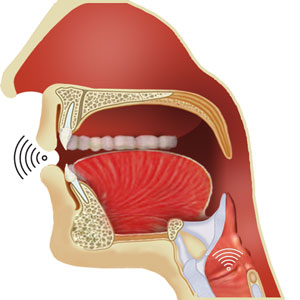 |  | 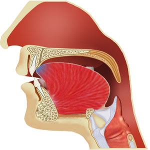 | 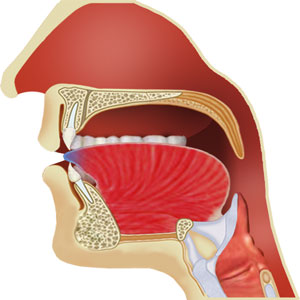 | 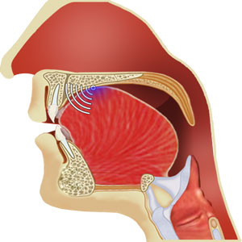 | 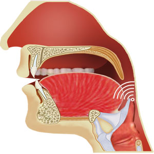 | 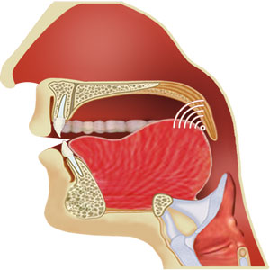 |  |

_And 20 more letters with detailed pronunciation guides..._

---

## 🔧 Configuration

### 🌐 **Environment Variables**

Create a `.env` file in the project root:

```env
# API Configuration
WHISPER_API_KEY=your_whisper_api_key_here
API_BASE_URL=https://api.openai.com/v1

# App Configuration
APP_NAME=Huroof
APP_VERSION=1.0.0
DEBUG_MODE=false
```

### 🎨 **Customization**

#### Theme Configuration

```dart
// lib/core/theme/app_theme.dart
class AppTheme {
  static ThemeData get theme => ThemeData(
    primarySwatch: Colors.blue,
    fontFamily: 'Tajawal',
    // Customize your theme here
  );
}
```

#### Localization

```dart
// assets/translations/
// Add your language files
ar.json
en.json
```

---

## 📁 Project Structure

```
huroof/
├── 📱 android/                 # Android-specific files
├── 📱 ios/                     # iOS-specific files
├── 📱 web/                     # Web platform files
├── 📱 windows/                 # Windows platform files
├── 📁 assets/                  # App assets
│   ├── 🎵 audio/               # Audio pronunciation files
│   ├── 📊 data/                # JSON data (letters_ar.json, letters_en.json)
│   ├── 🔤 fonts/               # Custom fonts (Amiri, Inter, Tajawal)
│   ├── 🖼️ images/              # Images and icons
│   │   ├── app_icon.png        # App icon
│   │   ├── splash.png          # Splash screen
│   │   └── makhraj/            # 28 Makhraj pronunciation images
│   ├── ✨ lottie/              # Animation files (alif_draw.json, etc.)
│   ├── 🎨 svgs/                # SVG graphics
│   └── 🌐 translations/        # Localization files (ar.json, en.json)
├── 📁 lib/                     # Main Dart code
│   ├── 📱 app/                 # Application layer
│   │   ├── 📊 data/            # Data models
│   │   ├── 🧩 modules/         # Feature modules
│   │   ├── 🛣️ routes/          # Navigation routes
│   │   └── 🔧 services/        # Business services
│   ├── 🏗️ core/               # Core utilities
│   │   ├── 🎨 assets/         # Asset management
│   │   ├── 📊 constants/       # App constants
│   │   ├── 🎨 styles/         # Text and color styles
│   │   ├── 🎨 theme/          # Theme configuration
│   │   ├── 🔧 utils/          # Utility functions
│   │   └── 🧩 widgets/        # Reusable widgets
│   ├── 📱 app.dart            # Main app widget
│   ├── ⚙️ config.dart         # App configuration
│   └── 🚀 main.dart           # App entry point
├── 📄 pubspec.yaml            # Dependencies
└── 📖 README.md               # This file
```

---

## 🛠️ Tech Stack

### 🎨 **Frontend**

- **Flutter**: Cross-platform mobile framework
- **Dart**: Programming language
- **GetX**: State management and navigation
- **Flutter ScreenUtil**: Responsive design
- **Lottie**: Smooth animations

### 🔧 **Backend & Services**

- **Dio**: HTTP client for API calls
- **Get Storage**: Local data persistence
- **Record**: Audio recording functionality
- **Audio Waveforms**: Audio visualization

### 🤖 **AI & Machine Learning**

- **OpenAI Whisper**: Speech recognition and analysis
- **Custom Audio Processing**: Voice comparison algorithms

### 🎨 **UI/UX Libraries**

- **Flutter SVG**: Vector graphics support
- **Cached Network Image**: Image caching
- **Skeletonizer**: Loading state animations
- **Smooth Page Indicator**: Page navigation

### 🌐 **Internationalization**

- **Flutter Localizations**: Multi-language support
- **Intl**: Date and number formatting

---

## 🤝 Contributing

We welcome contributions from the community! Here's how you can help:

### 🚀 **Getting Started**

1. **Fork the repository**
2. **Create a feature branch**
   ```bash
   git checkout -b feature/amazing-feature
   ```
3. **Make your changes**
4. **Commit your changes**
   ```bash
   git commit -m 'Add amazing feature'
   ```
5. **Push to the branch**
   ```bash
   git push origin feature/amazing-feature
   ```
6. **Open a Pull Request**

### 📋 **Contribution Guidelines**

- **Code Style**: Follow Dart/Flutter conventions
- **Documentation**: Update README for new features
- **Testing**: Add tests for new functionality
- **Issues**: Use GitHub issues for bug reports
- **Discussions**: Use GitHub discussions for questions

### 🐛 **Reporting Issues**

When reporting issues, please include:

- **Flutter version**: `flutter --version`
- **Device information**: OS, model, version
- **Steps to reproduce**: Detailed steps
- **Expected behavior**: What should happen
- **Actual behavior**: What actually happens

---

## 🧪 Testing

### 🧪 **Running Tests**

```bash
# Run all tests
flutter test

# Run tests with coverage
flutter test --coverage

# Run specific test file
flutter test test/widget_test.dart
```

### 📊 **Test Coverage**

We aim for high test coverage across:

- **Unit Tests**: Business logic and utilities
- **Widget Tests**: UI components
- **Integration Tests**: End-to-end workflows

---

## 📚 Documentation

### 📖 **Additional Resources**

- **[Software Requirements Specification](docs/SRS.md)**: Detailed technical specifications
- **[Refrence Study](docs/Reference_Study.pdf)**: Research methodology

### 🔗 **External Links**

- **[Flutter Documentation](https://docs.flutter.dev/)**
- **[GetX Package](https://pub.dev/packages/get)**
- **[OpenAI Whisper](https://openai.com/research/whisper)**

---

## 🗺️ Roadmap

### 🎯 **Version 1.1** (Coming Soon)

- [ ] **Enhanced AI Feedback**: Detailed pronunciation analysis
- [ ] **Progress Tracking**: User statistics and achievements
- [ ] **Gamification**: Points, badges, and leaderboards
- [ ] **Social Features**: Share progress with friends

### 🎯 **Version 1.2** (Future)

- [ ] **Advanced Lessons**: Word and sentence pronunciation
- [ ] **Teacher Dashboard**: Progress monitoring for educators
- [ ] **Offline Mode**: Complete offline functionality
- [ ] **Multiple Accents**: Support for different Arabic dialects

### 🎯 **Long-term Vision**

- [ ] **Web Platform**: Browser-based learning
- [ ] **API Access**: Third-party integration capabilities
- [ ] **Machine Learning**: Custom pronunciation models
- [ ] **Accessibility**: Enhanced support for users with disabilities

---

## 🎉 Acknowledgments

### 🙏 **Special Thanks**

- **OpenAI Team**: For the incredible Whisper ASR technology
- **Flutter Community**: For the amazing framework and ecosystem
- **Arabic Language Experts**: For pronunciation guidance and validation
- **Beta Testers**: For valuable feedback and suggestions

### 📚 **Research References**

This project builds upon extensive research in:

- **Arabic Phonetics**: Pronunciation accuracy studies
- **Speech Recognition**: AI-powered language learning
- **Educational Technology**: Mobile learning platforms
- **User Experience Design**: Arabic interface design

### 🛠️ **Open Source Libraries**

Huroof is built with amazing open-source libraries:

- **[GetX](https://pub.dev/packages/get)**: State management
- **[Lottie](https://pub.dev/packages/lottie)**: Animations
- **[Dio](https://pub.dev/packages/dio)**: HTTP client
- **[Record](https://pub.dev/packages/record)**: Audio recording

---

## 📜 License

This project is licensed under the **MIT License** - see the [LICENSE](LICENSE) file for details.

### 📄 **License Summary**

- ✅ **Commercial use** allowed
- ✅ **Modification** allowed
- ✅ **Distribution** allowed
- ✅ **Private use** allowed
- ❌ **Liability** not provided
- ❌ **Warranty** not provided

---

<div align="center">

### 🌟 **Made with ❤️ for Arabic Language Learners**

**Huroof** - Where AI meets Arabic pronunciation mastery

[](https://github.com/Abdalrahman-Alhamod/huroof)

---

**⭐ Star this repository if you found it helpful!**

</div>
